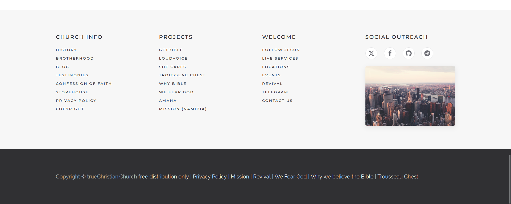

# Mandatory footer contract



## Footer terminology

The supplied source has two visible regions:

1. `div.tm-bottom.uk-section-muted.uk-section` — the large directory/link footer.
2. `footer > .uk-section-primary.uk-section` — the dark copyright footer.

Together they form the required bottom footer assembly. They must remain adjacent and must be applied to every site.

## Exact visual specification

| Part | Desktop contract |
| --- | --- |
| Directory surface | `#f7f7f7`, `70px` block padding |
| Directory container | `1200px` maximum width |
| Directory grid | Four equal `270px` tracks with `40px` gaps |
| Group heading | Montserrat 400, `16px/1.4`, uppercase, `2px` tracking, `20px` bottom gap |
| Group link | Montserrat 400, `11px/1.4`, uppercase, `2px` tracking, `5px` sibling gap, `#2d2e33` |
| Social controls | Two `36px` white circles, `20px` gaps, `#6c6d74` glyphs, `#e5e5e7` edge |
| Skyline slot | Desktop only, `270 × 180px`, `20px` top gap, `5px` radius, subdued shadow |
| Copyright surface | `#303033`, `70px` block padding |
| Copyright line | Raleway 400, `16px/1.6`; prefix and pipes 70%-white, links white |

The `1920 × 767` screenshot is a 1.25× capture. Do not copy its device-pixel widths as CSS values.

## Directory/link footer

The directory footer uses a light `#f7f7f7` background, a wide centered container, generous vertical space, and four desktop columns.

### Church Info

- History
- Brotherhood
- Blog
- Testimonies
- Confession of Faith
- Storehouse
- Privacy Policy
- Copyright

### Projects

- GETBIBLE
- Loudvoice
- SHE Cares
- Trousseau Chest
- Why Bible
- we fear God
- Amana
- Mission (Namibia)

This is a church-wide link directory. The presence of a project link does not make the shared theme specific to that project.

### Welcome

- Follow Jesus
- Live Services
- Locations
- Events
- Revival
- Telegram
- Contact Us

### Social Outreach

- GitHub
- Telegram

The historical source evidence includes X/Twitter and Facebook. The repository owner's current instruction supersedes that older footer content, so GitHub and Telegram are the canonical Social Outreach links.

The source also shows `/images/city-skyline-skyscrapers-top.jpg` beneath the social links on desktop. The owner-supplied `1920px × 1280px` original is included at `assets/footer/city-skyline-skyscrapers-top.jpg`. Its CSS slot remains `270px × 180px`, with a `5px` radius, `20px` top margin, and subdued shadow; it is hidden below `960px`.

## Copyright footer

The dark `#303033` footer appears immediately below the directory footer. Prefix text and separators are 70%-white; link text is white. Its exact sequence is:

```text
Copyright © trueChristian.Church free distribution only | Privacy Policy | Mission | Revival | We Fear God | Why we believe the Bible | Trousseau Chest
```

See `src/data/site-chrome.json` for exact URLs. The line may wrap on smaller screens, but its order and content remain fixed.

The source HTML records internal destinations as root-relative paths. The portable template resolves them to `https://truechristian.church` so the required global directory remains correct when this footer is installed on another domain. A main-site Joomla/YOOtheme implementation may retain the original root-relative form.

## Responsive rules

- Desktop: four columns, left-aligned.
- Small/tablet: two columns where space permits.
- Narrow mobile: one column, centered.
- Social buttons stay touch-friendly and retain visible focus.
- Copyright links wrap naturally; never force horizontal scrolling.

## Reusable markup

Use `src/html/site-footer.html`. It includes both portable `tcc-*` classes and relevant YOOtheme/UIkit compatibility classes.
